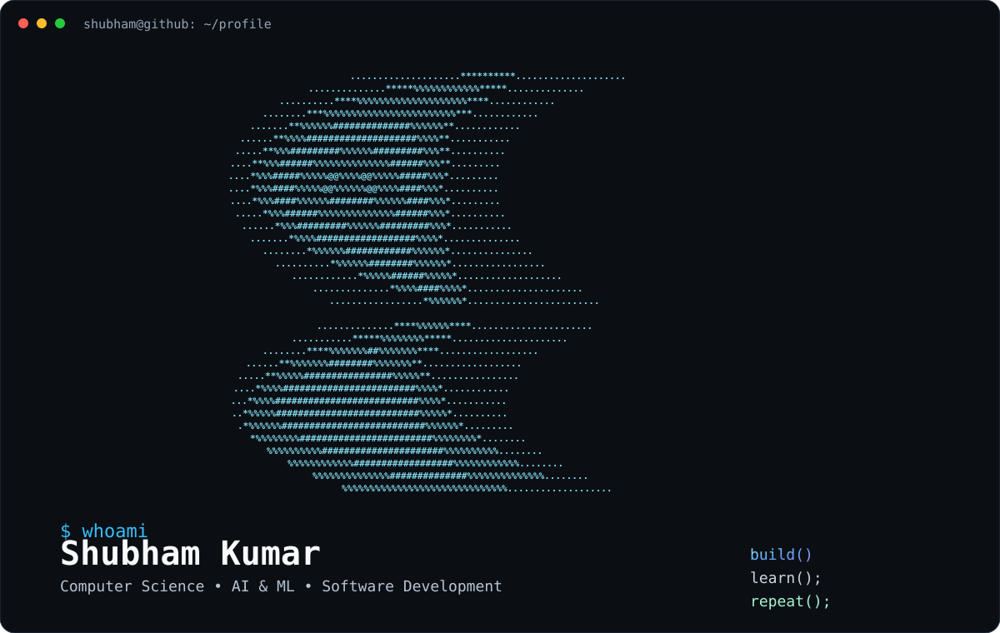

<div align="center">



<p>
  <a href="https://github.com/Shub202">github</a>
  ·
  <a href="https://www.linkedin.com/in/shubham-kumar-b21037295">linkedin</a>
  ·
  <a href="mailto:info.shubhamkumar2001@gmail.com">email</a>
</p>

</div>

---

## About

Computer Science undergraduate specializing in **Artificial Intelligence & Machine Learning**, with hands-on internship experience in **Python development, AI/ML, Java, and web development**.

I like building practical systems end-to-end: understanding the problem, working with the data or architecture, implementing the solution, and improving it through iteration.

> **Build. Learn. Improve. Repeat.**

---

## stack

```text
python        java          javascript       sql          react
scikit-learn  xgboost       deep learning    opencv      pandas
numpy         matplotlib    seaborn          plotly      yellowbrick
html5         css3          dom              fetch api   spring boot
git           github        vscode            jupyter     kaggle
```

<p align="center">
  
</p>

---

## stats

<div align="center">


<br>


<br>


</div>

---

## contributions

<div align="center">

<picture>
  <source media="(prefers-color-scheme: dark)" srcset="https://raw.githubusercontent.com/Shub202/Shub202/output/github-contribution-grid-snake-dark.svg">
  <source media="(prefers-color-scheme: light)" srcset="https://raw.githubusercontent.com/Shub202/Shub202/output/github-contribution-grid-snake.svg">
  
</picture>

</div>

---

## activity

<div align="center">


</div>

---

## profiles

<div align="center">

<a href="https://www.hackerrank.com/info_shubhamkum1">
  
</a>

<a href="https://leetcode.com/u/l3uvGOhSI6/">
  
</a>

</div>

---

## contact

<div align="center">

**Shubham Kumar** · Asansol, West Bengal, India

<a href="mailto:info.shubhamkumar2001@gmail.com">info.shubhamkumar2001@gmail.com</a>
·
<a href="https://www.linkedin.com/in/shubham-kumar-b21037295">linkedin</a>
·
<a href="https://github.com/Shub202">github</a>

<br><br>


</div>

<p align="center">
  
</p>

<div align="center">
<sub>Build practical systems · Learn deeply · Ship better</sub>
</div>
